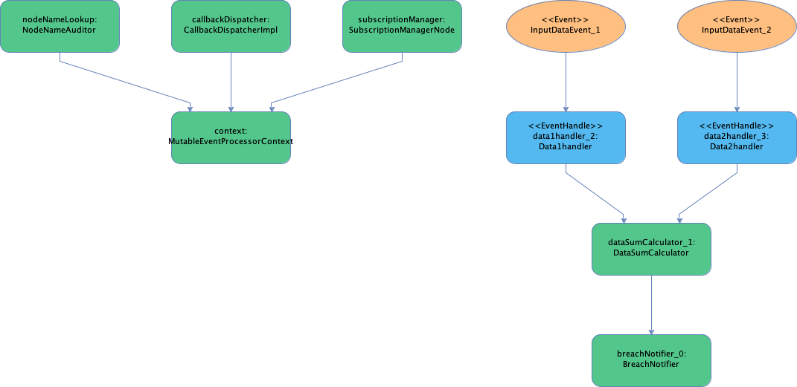

# Hello world example imperative construction

creates a processing graph imperatively, extracts double values from events, calculates the sum and prints a
message to console if the sum is greater than a 100.

The graph is constructed [imperatively](src/main/java/com/fluxtion/example/Main.java#L20), 
the root node, SumLogger, is passed to the Fluxtion compiler. The compiler reflects the
object graph and generates an EventProcessor that invokes the node methods in the correct topological order in response
to an incoming event. App classes use annotations to mark methods that will be events handlers in the final 
event processor.

- @OnEventHandler annotation declares the [entry point](src/main/java/com/fluxtion/example/Main.java#L43) 
of an execution path, triggered by an external event. 
- @OnTrigger annotated methods indicate call back methods to be invoked if a parent propagates a change. 
- The return flag from the DataAddition [@OnTrigger](src/main/java/com/fluxtion/example/Main.java#L93) method, calculate, 
indicates if the event should be propagated. In this case the event is only propagated if the sum > 100.

### Node diagram of event processor

